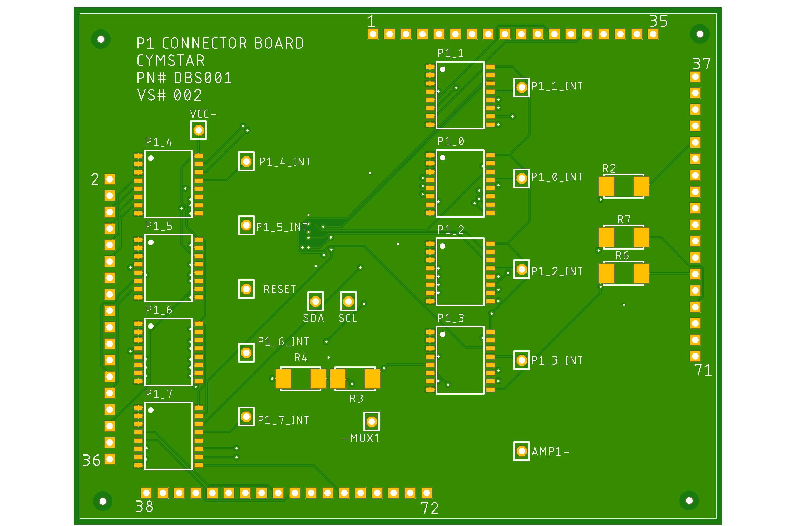
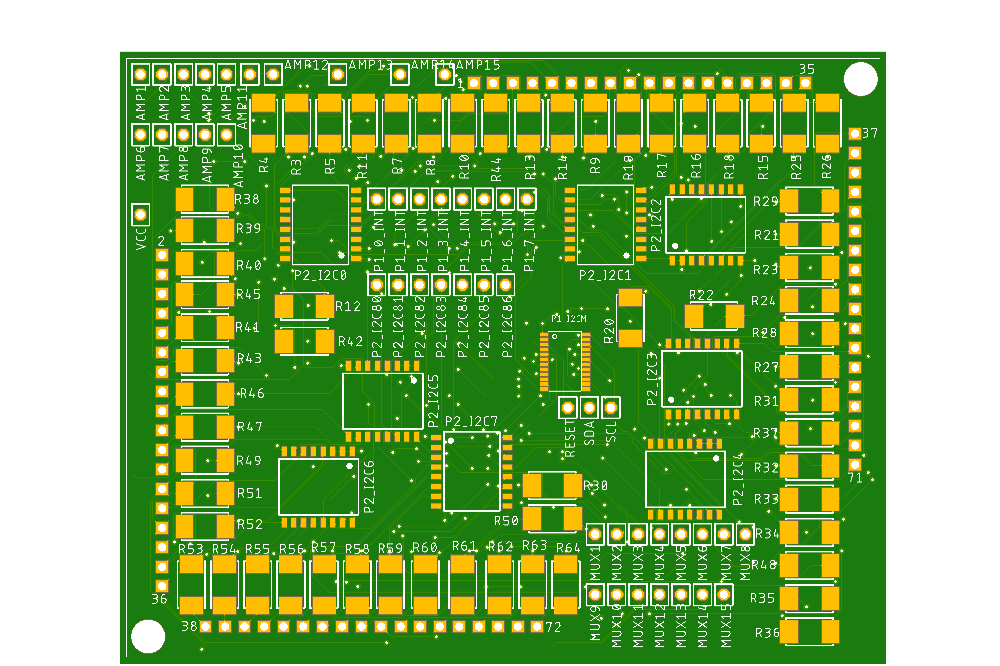
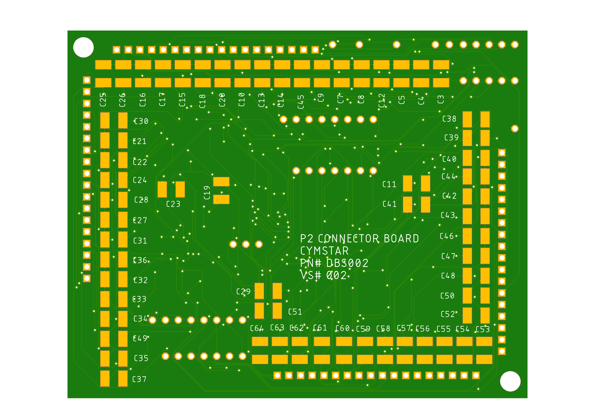

# DACBUS Tester

Hardware testing system for synchronous, analog and I/O peripherals of the DACBUS backplane, 
used in military aircraft simulators and other avionics systems.

> Note: This repository contains a **sanitized, non-proprietary representation** of the
> system architecture and software tooling. No controlled or non-approved, employer-specific information
> is included.

---

## Overview

DACBUS Tester is a test platform designed to simulate the controller and DACBUS in order to
test and diagnose synchronous, analog and digital I/O computer cards that would otherwish be 
connected to the DACBUS backplane.

The system was developed to support:
- Hardware verification
- Fault isolation
- Technician-assisted troubleshooting
- Repeatable test execution

This repository focuses on the **software tooling and system-level design concepts**
rather than production hardware documentation.

---

## System Context

In typical deployments, the DACBUS functions as a backplane bus connecting:
- A main controller
- Distributed peripheral modules
- Analog and synchronous I/O interfaces

The tester acts as an external diagnostic interface capable of stimulating,
monitoring, and validating bus-connected peripherals.

All schematics shown were made in Eagle PCB for two reasons.
- Eagle PCB is free which drastically cut costs for this project
- AutoCAD Electrical does not produce PCBs.

---

## Architecture (High Level)

Data flow is always with respect to the C# DACBUS Tester software, 
which is simulating the HOST computer of the aircraft simulator system.
Signals are first initiated by the softwars output to the card. The
card, then, reacts and sends its signals to the softwares inputs. The
communication is I2C and utilizes I2C multiplexing ICs to make room for the proper
amount of connections needed. Each card tested has two male connectors that are 
recieved into the test fixture by two R636 Vector connectors (72-pin). 
Each connector can accept I/O or analog on specific pins, depending on the card tested. 
Much consideration was taken to account for this circuitry setup. AC and DC 
filtration was needed to anticipate incomming signals or the lack thereof 
for each input to the software.

Below are schematics of both P1 and P2 connector boards and their fully articulated PCBs.

[P1 Connector Board](DacBuss_Simulator_DBS_Portfolio/P1_ConnectorBoard.pdf)

[P2 Connector Board](DacBuss_Simulator_DBS_Portfolio/P2_ConnectorBoard_Schematic.pdf)

---

## Software

The software requires the user to select a board to test.

In the picture below, a syncronous output card is selected which outputs analog data to the 
software via Arduino analog input pins. The software then feeds the card digital data and selects
a channel on the SOP card, highlighting the output in blue.

